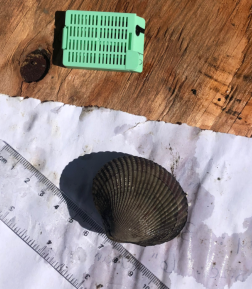

```{r setup, include=FALSE}
knitr::opts_chunk$set(echo = FALSE)
```

## Cockle Clam Collection

These data are associated with a sampling over the summer to determine the reproductive status of clams from different areas in Puget Sound. Currently we only have size data. [Watch a video](https://uw.hosted.panopto.com/Panopto/Pages/Viewer.aspx?id=8c080c5d-7e85-49f3-846b-ab9b012116db) of a sampling event. All images are located [here](https://github.com/RobertsLab/project-cockle-repro)

## Pretty clams

There are couple of ways to include an image easily.
One is markdown it from a url 


## Local image

Another way is 

```

```



## Slide with Plot

```{r pressure}
plot(pressure)
```